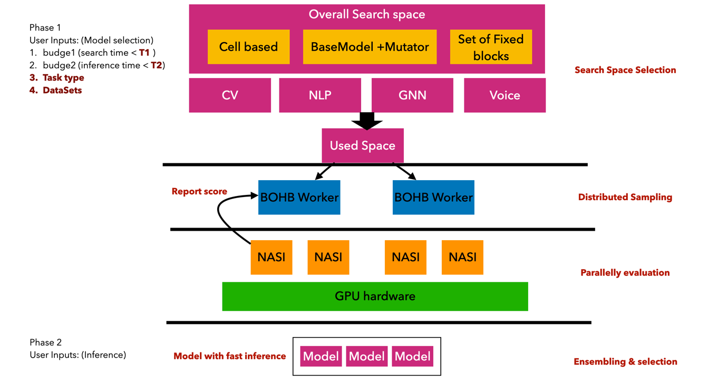
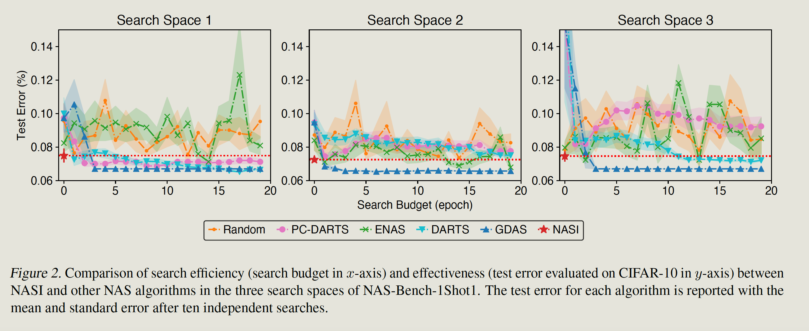

# Requirement

torch              1.11.0
torchaudio         0.11.0
torchvision        0.12.0
TensorFlow 1.15
python 3.60

# CIDDA
ssh shaofeng@ciidaa.d2.comp.nus.edu.sg
pwd: shaofengtmp

ssh xingnaili@10.0.0.125
xingnailincrs

# XAI
ssh shaofeng@xai.d2.comp.nus.edu.sg
3U3Ge}5~.CpGo]U]-hi)

ssh shaofeng@172.28.176.234
3U3Ge}5~.CpGo]U]-hi)

# Pip install
conda env export --no-builds > env.yml
conda env create -f env.yml

# envs, When run in server, add path to env
    export PATH="$PATH:/home/shaofeng/naili/Fast-AutoNAS/src"
    export PYTHONPATH=$PYTHONPATH:/home/shaofeng/naili/Fast-AutoNAS/src
    export PYTHONPATH=$PYTHONPATH:/home/shaofeng/naili/Fast-AutoNAS/main/
    export PATH="$PATH:/home/shaofeng/naili/Fast-AutoNAS/main/"
    export PYTHONPATH=$PYTHONPATH:/home/shaofeng/naili/Fast-AutoNAS/main/0_local_api/
    export PATH="$PATH:/home/shaofeng/naili/Fast-AutoNAS/main/0_local_api/"
    export PYTHONPATH=$PYTHONPATH:/home/shaofeng/naili/Fast-AutoNAS/main/2_verify_sampler/
    export PATH="$PATH:/home/shaofeng/naili/Fast-AutoNAS/main/2_verify_sampler/"
    export PYTHONPATH=$PYTHONPATH:/home/shaofeng/naili/Fast-AutoNAS/main/3_benchmark_sampler/
    export PATH="$PATH:/home/shaofeng/naili/Fast-AutoNAS/main/3_benchmark_sampler/"
    export PYTHONPATH=$PYTHONPATH:/home/shaofeng/naili/Fast-AutoNAS/main/statistic_lib/
    export PATH="$PATH:/home/shaofeng/naili/Fast-AutoNAS/main/statistic_lib/"

# Env in pandax2

    export PYTHONPATH=$PYTHONPATH:/home/naili/Fast-AutoNAS/src
    export PATH="$PATH:/home/naili/Fast-AutoNAS/src"
    export PYTHONPATH=$PYTHONPATH:/home/naili/Fast-AutoNAS/main/
    export PATH="$PATH:/home/naili/Fast-AutoNAS/main/"
    export PYTHONPATH=$PYTHONPATH:/home/naili/Fast-AutoNAS/main/0_local_api/
    export PATH="$PATH:/home/naili/Fast-AutoNAS/main/0_local_api/"
    export PYTHONPATH=$PYTHONPATH:/home/naili/Fast-AutoNAS/main/2_verify_sampler/
    export PATH="$PATH:/home/naili/Fast-AutoNAS/main/2_verify_sampler/"
    export PYTHONPATH=$PYTHONPATH:/home/naili/Fast-AutoNAS/main/3_benchmark_sampler/
    export PATH="$PATH:/home/naili/Fast-AutoNAS/main/3_benchmark_sampler/"
    export PYTHONPATH=$PYTHONPATH:/home/naili/Fast-AutoNAS/main/statistic_lib/
    export PATH="$PATH:/home/naili/Fast-AutoNAS/main/statistic_lib/"
    export PYTHONPATH=$PYTHONPATH:/home/naili/Fast-AutoNAS/main/apiserver/
    export PATH="$PATH:/home/naili/Fast-AutoNAS/main/apiserver/"

# local env
    export PYTHONPATH=$PYTHONPATH:/Users/kevin/project_python/Fast-AutoNAS/src
    export PATH="$PATH:/Users/kevin/project_python/Fast-AutoNAS/src"
    export PYTHONPATH=$PYTHONPATH:/Users/kevin/project_python/Fast-AutoNAS/main/
    export PATH="$PATH:/Users/kevin/project_python/Fast-AutoNAS/main/"
    export PYTHONPATH=$PYTHONPATH:/Users/kevin/project_python/Fast-AutoNAS/main/0_local_api/
    export PATH="$PATH:/Users/kevin/project_python/Fast-AutoNAS/main/0_local_api/"
    export PYTHONPATH=$PYTHONPATH:/Users/kevin/project_python/Fast-AutoNAS/main/2_verify_sampler/
    export PATH="$PATH:/Users/kevin/project_python/Fast-AutoNAS/main/2_verify_sampler/"
    export PYTHONPATH=$PYTHONPATH:/Users/kevin/project_python/Fast-AutoNAS/main/3_benchmark_sampler/
    export PATH="$PATH:/Users/kevin/project_python/Fast-AutoNAS/main/3_benchmark_sampler/"
    export PYTHONPATH=$PYTHONPATH:/Users/kevin/project_python/Fast-AutoNAS/main/statistic_lib/
    export PATH="$PATH:/Users/kevin/project_python/Fast-AutoNAS/main/statistic_lib/"
    export PYTHONPATH=$PYTHONPATH:/Users/kevin/project_python/Fast-AutoNAS/main/apiserver/
    export PATH="$PATH:/Users/kevin/project_python/Fast-AutoNAS/main/apiserver/"

# Sampling Algorithms
    1. https://github.com/automl/SMAC3
    2. https://github.com/microsoft/FLAML
    3. https://github.com/automl/HpBandSter, https://automl.github.io/HpBandSter/build/html/auto_examples/example_5_mnist.html

[Sampling summary](https://github.com/huawei-noah/vega/blob/master/docs/cn/algorithms/hpo.md)

# Problems

    1. 多分类，求∇0 f(xi), 是不是只考虑这个样本的true label 的那以个维度的输出 f ?
    2. NASI 什么时候算一个epoch， 怎么判断是否满足了一个epoch， 怎么定义T 从而看出满足了一个epoch?

       

