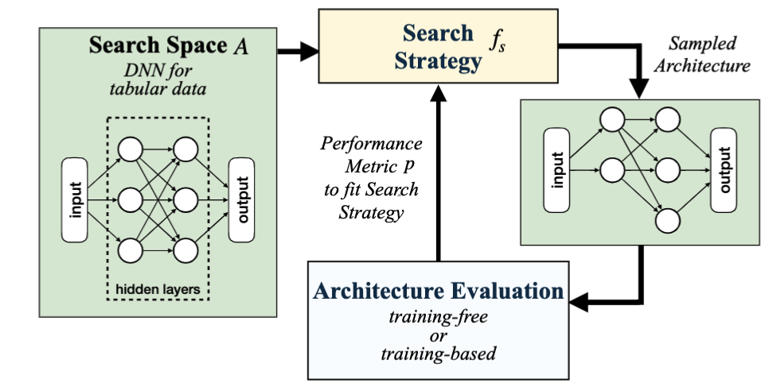

# ATLAS: Anytime Neural Architecture Search on Tabular Data
[TOC]

# Framework Implementation Layout

**Implementation Details:** For seamless implementation, we design each component with an emphasis on modularity so that each component can be implemented independently. Below are the specific links to different components:

   - [Search Space](https://anonymous.4open.science/r/anytimenas4tab/internal/ml/model_selection/src/search_space/mlp_api/space.py)
   - [ExpressFlow](https://anonymous.4open.science/r/anytimenas4tab/internal/ml/model_selection/src/eva_engine/phase1/algo/express_flow.py) and other 9 [TRAILERs](https://anonymous.4open.science/r/anytimenas4tab/internal/ml/model_selection/src/eva_engine/phase1/evaluator.py)
   - [Filtering Phase](https://anonymous.4open.science/r/anytimenas4tab/internal/ml/model_selection/src/eva_engine/phase1/run_phase1.py)
   - [Refinement Phase with Successive Halving](https://anonymous.4open.science/r/anytimenas4tab/internal/ml/model_selection/src/eva_engine/phase2/run_sh.py)
   - [Coordinator](https://anonymous.4open.science/r/anytimenas4tab/internal/ml/model_selection/src/eva_engine/coordinator.py)
   - [Model Selection with Time Budget](https://anonymous.4open.science/r/anytimenas4tab/internal/ml/model_selection/exps/macro/anytime_simulate.py)




# Config Environments

```bash
# Create virtual env
conda config --set ssl_verify false
conda create -n "atlas" python=3.8.10
conda activate atlas
pip install -r requirement.txt

cd ATLAS

# make a dir to store all results.
mkdir ../exp_data
```

# Reproduce the results

## NAS-Bench-Tabular

NAS-Bench-Tabular can either be **downloaded** or built from scratch.

### Download NAS-Bench-Tabular

1. **Download** the dataset using the following link, and extract them to `exp_data`

```bash
https://drive.google.com/file/d/1cJhVBMFIseYEW2ouM3WHw0STk1nrpsSC/view?usp=sharing
```

### Build NAS-Bench-Tabular

2. Build the **NAS-Bench-Tabular** from scratch

```python
# Construct NAS-Bench-Tabular:
## 1. Training all models.
bash internal/ml/model_selection/scripts/nas-bench-tabular/score_all_modesl_frappe.sh
bash internal/ml/model_selection/scripts/nas-bench-tabular/score_all_modesl_uci.sh
bash internal/ml/model_selection/scripts/nas-bench-tabular/score_all_modesl_criteo.sh

## 2. Scoring all models using all TRAILERs.
bash internal/ml/model_selection/scripts/nas-bench-tabular/score_all_modesl_frappe.sh
bash internal/ml/model_selection/scripts/nas-bench-tabular/score_all_modesl_uci.sh
bash internal/ml/model_selection/scripts/nas-bench-tabular/score_all_modesl_criteo.sh
```

3. Optionally, Build the **NAS-Bench-Img** from scratch

   To facilitate the experiments and query speed (NASBENCH API is slow)

   1. We retrieve all results from NASBENCH API and store them as a json file.
   2. We score all models in NB201 and 28K models in NB101.
   3. We search with  EA + Score and record the searching process in terms of
       `run_id,  current_explored_model, top_400 highest scored model, time_usage`
        to SQLLite.

```python
# 1. Record NASBENCH API data into json file
## This requires to install nats_bench: pip install nats_bench
bash ./internal/ml/model_selection/scripts/nas-bench-img/convert_api_2_json.sh

# 2. Scoring all models using all TRAILERs.
nohup bash ./internal/ml/model_selection/scripts/nas-bench-img/score_all_models.sh &

# 3. Explore with EA and score architectures, and store exploring process into SQLLite
bash ./internal/ml/model_selection/scripts/nas-bench-img/explore_all_models.sh

# 4. Generate the baseline.
bash ./internal/ml/model_selection/scripts/baseline_system_img.sh
```

### Reproduce Fig: (ECDF, Parameter/AUC )

```bash
# Plot the ECDF figure
python ./internal/ml/model_selection/exps/nas_bench_tabular/measure_ecdf.py
# Plot the parameter and AUC relationship
python ./internal/ml/model_selection/exps/nas_bench_tabular/measure_param_auc.py
```

### Reproduce Fig: Search Strategy

```bash
bash ./internal/ml/model_selection/scripts/micro_search_strategy.sh
```

The following experiment can then query filtering phase results based on `run_id`.

## Anytime NAS on Tabular data

With the above **NAS-Bench-Tabular**, we could run various experiments.

```bash
# 1. Generate the results for ploting the figure
## tabular data: training-base-NAS
bash internal/ml/model_selection/scripts/baseline_system_tab.sh
## tabular data: training-free-NAS, 2phase-NAS
nohup bash internal/ml/model_selection/scripts/anytime_tab.sh &
## image data: training-base-ms, training-free-ms, 2phase-NAS
nohup bash internal/ml/model_selection/scripts/anytime_img_w_baseline.sh &

# 2. Draw figure
python internal/ml/model_selection/exps/macro/anytime_tab_draw.py
python internal/ml/model_selection/exps/macro/anytime_img_draw.py
python exps/main_np/base_line/1.\ anytime_draw.py
```

## Micro: Benchmark Metrics

### Compute/Visulation Correlation

```bash
export PYTHONPATH=$PYTHONPATH:./internal/ml/model_selection
conda activate atlas
python ./internal/ml/model_selection/exps/micro/benchmark_correlation.py
```

### Sensitivity study

```bash
## Reproduce Table 3-6
# Adjust the input data, which can be scored under various TRAILERs
# Adjust the initialization method at src/search_space/mlp_api/space.py
# Then run
python ./internal/ml/model_selection/exps/micro/benchmark_correlation.py
```

## Micro: Benchmark Budge-Aware Algorithm

```bash
bash ./internal/ml/model_selection/scripts/micro_budget_aware_alg.sh
```

## Micro: Benchmark `N, K, U`

With ranking the models by ther ExpressFlow score in the filtering phase, we aim to determine

1. Further examinng more architecture  (**K**) with each going through less training epoch (**U**) is more easier to find good architecture?
   or examine less but each training more epochs?
2. How many architectures to explore (**N**) and how many to keep (**K**) ?

```bash
bash internal/ml/model_selection/scripts/micro_nku_tradeoff.sh
```

This is the experimental result conducted at the UCI Diabetes datasets.
Clearly, exploring more architectures in the refinement phase (large **K** ) is more helpful in finding the a better architectures.
Although increasing **U** can find a better architecture accurately, it runs more training epochs leading to higher training cost.

Then we fix **U=1** for cost efficiency and determine N/K for higher searching effectiveness.
Clearly, K/N reaching 100 yields better-scheduling results in both image and tabular datasets, thus, we set **N/K=100** in the coordinator.

# Baselines

We compare with Training-Based NAS, TabNAS, and Training-Free NAS etc.

# More Experiments

All experiments were conducted using the Frappe dataset.

1. Measure the computational costs.

   ```bash
   # we measure the computational cost for each metrics
   bash ./internal/ml/model_selection/exps/micro/resp/benchmark_cost.sh

   # train one model to check the total time usage
   bash ./internal/ml/model_selection/scripts/nas-bench-tabular/train_one_model_dev.sh
   ```

2. Measure the search cost, multiple training-free or training-based combinations effectiveness, e.g,. warm-up and movel proposal.

   ```bash
   # RL, RE, RS + training-based model evaluation
   bash ./internal/ml/model_selection/scripts/micro_search_strategy.sh
   # This will read previous files, and run warm-up/move proposal, and draw figures.
   bash ./internal/ml/model_selection/exps/micro/resp/benchmark_search_cost.sh
   ```

3. How does the initial search phase (number of K) influence the performance?

   ```bash
   python ./internal/ml/model_selection/exps/micro/resp/benchmark_k_fix_time.py
   ```

4. Would it be beneficial to introduce some degree of random noise when selecting the top-K architectures?

   ```bash
   python ./internal/ml/model_selection/exps/micro/resp/benchmark_noisy_influence.py
   ```

5. One-Shot NAS study.

   ```bash
   nohup bash ./internal/ml/model_selection/scripts/benchmark_weight_sharing.sh &
   ```