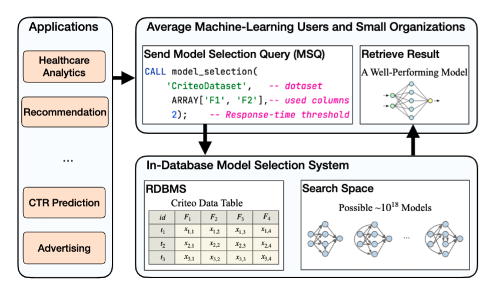
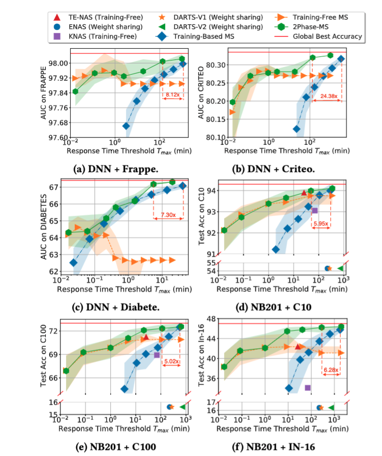
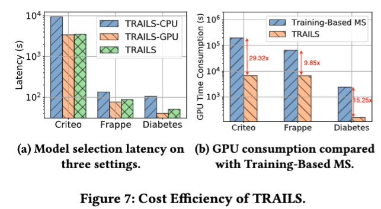
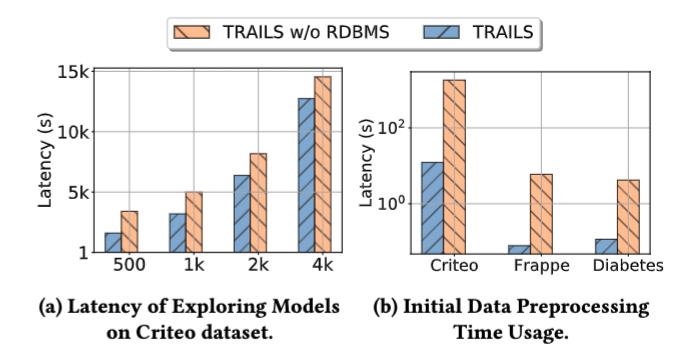
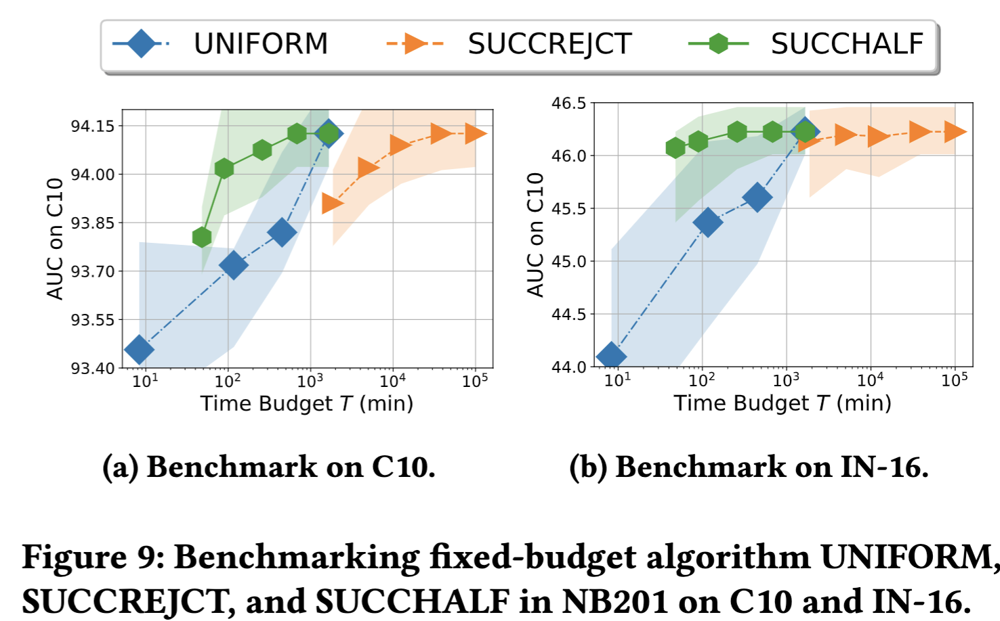
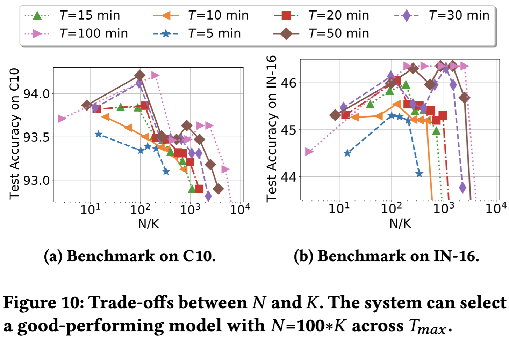
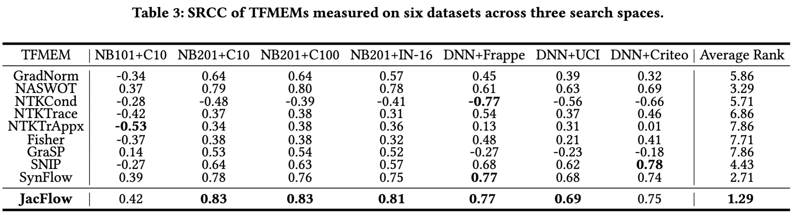
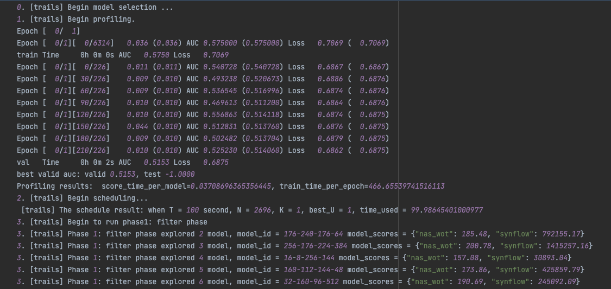
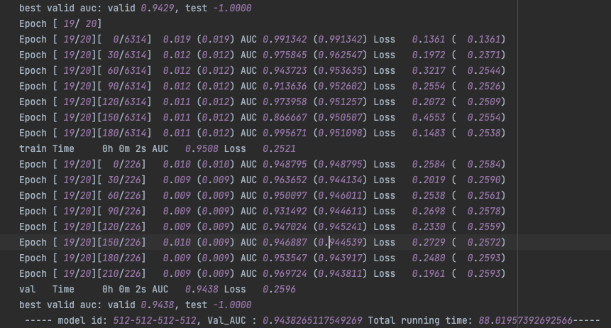

# TRAILS: A Database Native Model Selection System



# Config Environments

```bash
# Create virtual env
conda config --set ssl_verify false
conda create -n "trails" python=3.6.13
conda activate trails


# Create virtual env
conda config --set ssl_verify false
conda create -n "firmest38" python=3.8.10
pip install  tqdm==4.47.0 --trusted-host pypi.org --trusted-host files.pythonhosted.org
pip install torch==1.8.1 sklearn==0.0 torchvision==0.9.1
conda activate firmest38


# Install
pip install -r requirements.txt  --trusted-host pypi.org --trusted-host files.pythonhosted.org
pip install  tqdm==4.47.0 --trusted-host pypi.org --trusted-host files.pythonhosted.org
pip install torch==1.8.1+cu111 torchvision==0.9.1+cu111 torchaudio==0.8.1 -f https://download.pytorch.org/whl/torch_stable.html --trusted-host pypi.org --trusted-host files.pythonhosted.org

# Init env
source init_env

# make a dir to store all results. 
mkdir `exp_data`
```

# Reproduce the results

1. Download the dataset using the following link, and extract them to `result_base`

```bash
https://drive.google.com/file/d/1fpKAqvvVooiJh2EIfz18UMsBE4demHL2/view?usp=sharing
```

## Reproduce Figure5 and Figure6

Update the dataset_name and then run.

```bash
python exps/main_v2/analysis/1.\ anytime_draw.py
```

Reproduce Figure6

```bash
# generate the running results
python exps/main_v1/4_system/analysis/2_benchmarking/0_macro_com_with_base.py --dataset cifar10
--search_space nasbench201
# plot the results
python exps/main_v1/4_system/analysis/2_benchmarking/0_draw_compare_with_base.py
```



## Reproduce Figure7

```bash
python exps/main_v2/analysis/2.\ cost_draw.py
python exps/main_v2/analysis/3.\ cost_train_based.py
```



## Reproduce Figure8

```bash
# draw figure 8(a) 
python exps/main_v2/analysis/5.draw_IDMS_var_workloads.py
# draw figure 8(b)
python exps/main_v2/analysis/6.draw_IDMS_dataloading.py
```



## Reproduce Figure9

```bash
# generate results
python main/4_system/analysis/2_benchmarking/1_micro_phase2.py
# draw with the following cmd
python main/4_system/analysis/2_benchmarking/1_micro_phase2_only_draw.py
```



## Reproduce Figure 10

```bash
# draw results with the following:
python main/4_system/analysis/1_sys_design/plot_1.py
python main/4_system/analysis/1_sys_design/plot_2.py
```



## Reproduce Table 2

```bash
python exps/main_v2/analysis/4.\ measure_correlation.py
```




# Run end2end model selection

download the dataset and put it in the `exp_data/data/structure_data`

```
python main.py --budget=100 --dataset=frappe
```

Check the log at the `Logs`





