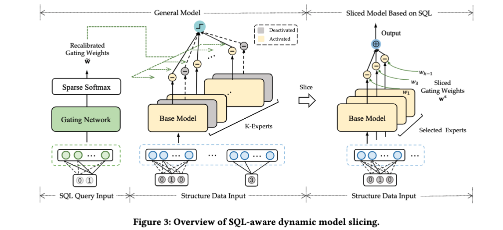

# SAMS: SQL Aware Model Slicing System



# Config Environments

```bash
# Create virtual env
conda config --set ssl_verify false
conda create -n "sams" python=3.6.13
conda activate sams

# Install
pip install -r requirements.txt  --trusted-host pypi.org --trusted-host files.pythonhosted.org
pip install  tqdm==4.47.0 --trusted-host pypi.org --trusted-host files.pythonhosted.org
pip install torch==1.8.1+cu111 torchvision==0.9.1+cu111 torchaudio==0.8.1 -f https://download.pytorch.org/whl/torch_stable.html --trusted-host pypi.org --trusted-host files.pythonhosted.org

# Init env
source init_env
```

# Run one job

This is a example shell script to start a training process

we train a `sparsemax_vertical_sams` with `armnet` base model. and set the number of experts to 16. the `data_dir `specify the data directory and `exp` specify where the experiment details and best model is saved. `train_dir` specify the name of the directory of the experiment data.

```shell
$ python3 main.py \
    --device cuda:0 --net sparsemax_vertical_sams --expert armnet\
    --data_dir /hdd1/sams/data/ --exp /hdd1/sams/tensor_log \
    --dataset bank --nfeat 80 --nfield 16 \
    --moe_hid_layer_len 32 --data_nemb 10\
    --nhead 4 --nhid 16\
    --hid_layer_len 32 --sql_nemb 5\
    --dropout 0.1   \
    --K 16 --alpha 2 --max_filter_col 13\
    --epoch 50 --batch_size 1024 --lr 0.005 \
    --seed 3407 --beta 0.01 --gamma 0.02\
    --train_dir armnet_K16_alpha2  --report_freq 5

```

## Command Line Arguments

For `data_set_config(parser)` Function:

- `--data_dir`: Path of the data and result parent folder. Default is `"./third_party/data/"`.
- `--dataset`: Specifies the dataset to use. Default is `"adult"`.
- `--workload`: Workload name according to different sample strategies. Default is `"random_100"`.

For `tensorboard_config(parser)` Function:

- `--exp`: The directory to store training Tensorboard logs. Default is `"./tensor_log_baseline"`.
- `--train_dir`: The name of this train process.
- `--seed`: The random seed value. Default is `1998`.

For `parse_arguments()` Function:

- `--device`: Specifies the device to run on. Default is `"cpu"`.
- `--log_folder`: The name of the folder to store logs. Default is `"sams_logs"`.
- `--log_name`: The name of the log file. Default is `"run_log"`.

For `arch_args(parser)` Function:

- `--net`: Specifies the type of network to use. Default is `"sparsemax_vertical_sams"`. Choices include: 'dnn', 'afn', 'cin', 'armnet', 'nfm', 'sparsemax_vertical_sams', 'meanMoE', 'sparseMoE'.
- `--K`: The number of duplication layers of each MOE layer. Default is 16.
- `--C`: The number of chosen experts when training the Sparse MoE network. Default is `1`.
- `--noise`: Whether to add noise when training the Sparse MoE network. Default is `True`.
- `--moe_num_layers`: The number of hidden MOE layers of MOENet. Default is `2`.
- `--moe_hid_layer_len`: Hidden layer length in the MoeLayer. Default is `10`.
- `--hyper_num_layers`: The number of hidden layers of the hyperNet. Default is `2`.
- `--hid_layer_len`: Hidden layer length in the hyperNet. Default is `10`.
- `--output_size`: Output size for binary classification tasks. Default is `1`.
- `--data_nemb`: Data embedding size. Default is `10`.
- `--sql_nemb`: SQL embedding size. Default is `10`.
- `--dropout`: Dropout rate. Default is `0.0`.
- `--nhead`: The number of attention heads in ARMNet. Default is `4`.
- `--nhid`: The number of hidden size of a specific module in the model, such as the attention layer in ARMNet or AFN layer in AFN. Default is `4`.
- `--expert`: Specifies which expert to choose (e.g., dnn/afn/cin/armnet).

# Experiment Reproduction

We save all experiment scripts under the `scripts` directory.

the `scripts/baseline` includes all baseline methods' corresponding experiment shell command, 

it includes 5 single base models (afn, armnet,cin, dnn, nfm), and 2 MoE based enhancement methods (sparseMoe and meanMoE)


the `scripts/exp` includes all our own method's (Model Slicing) experiment command, it includes 5 base models (afn, armnet,cin, dnn, nfm).


the `scripts/expert_exp` includes the experiment about the effect of number of experts. We choose two base model (afn and dnn) to conduct experiments on two datasets (adult and frappe). Thus, there are four directories, `afn_adult` `afn_frappe` `dnn_adult` and `dnn_frappe`


the `scripts/imp_exp` includes the ablation study's experiment command. we only choose `dnn` as base model and conduct experiment on two dataset `adult` and `frappe`. there are four commands in each shell scripts, which corresponds to four situations respectively ( w/o sparsity , w/o importance , w/o both,  w/ both)
