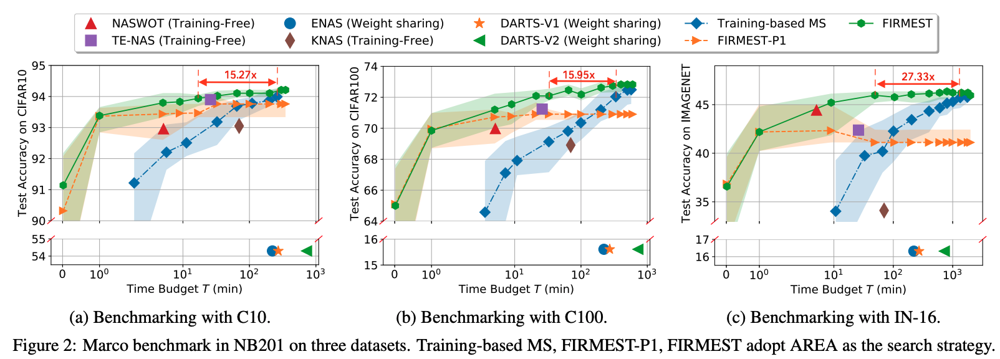
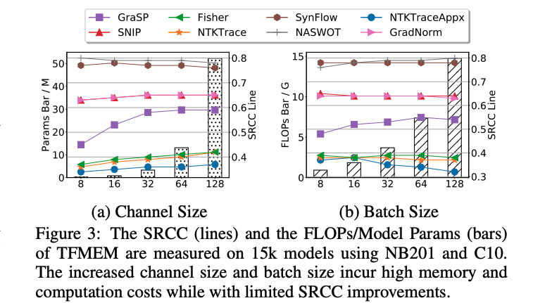
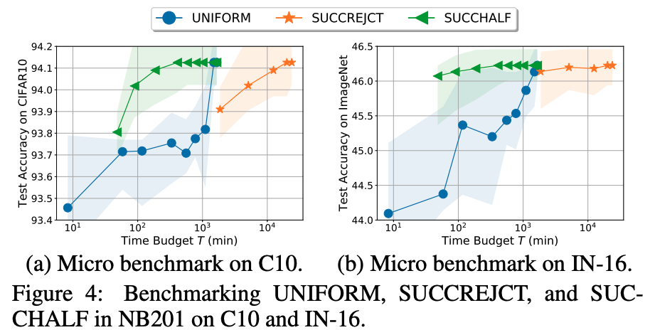
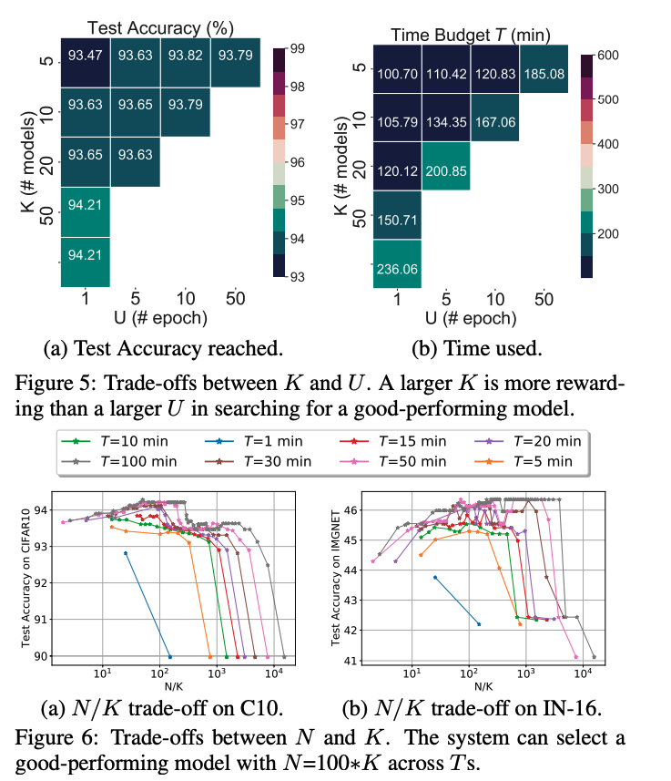

This is about how to reproduce the results. 

# Download

1. The code is available at the https://anonymous.4open.science/r/FIRMEST-B7F4/
2. The data is available at the https://drive.google.com/file/d/1I3_U22rKFxoYaYTfLLkzGWFXz8IxqHF2/view
3. Download the dataset and extract them to `./result_base`

# Requirement

```bash
torch              1.11.0
torchaudio         0.11.0
torchvision        0.12.0
TensorFlow 1.15
python 3.60s
```

Pip install


```bash
conda env create -f env.yml
```

# Reproduce the results

In the experiments,  we score each model in both NB101 and NB201 with all training-free-model evaluation metrics, and the search results are stored at SQLlite. 

reproducing those results

```bash
python main/4_system/1_model_selection/FastAutoNAS/model_evaluation_simulate.py --dataset cifar10 --search_space nasbench201 --api_loc NAS-Bench-201-v1_1-096897.pth
```

Or just download our results directly: https://drive.google.com/file/d/1I3_U22rKFxoYaYTfLLkzGWFXz8IxqHF2/view

1. Reproduce Fig2
```bash
# generate the running results
python main/4_system/analysis/2_benchmarking/0_macro_com_with_base.py --dataset cifar10 --search_space nasbench201
# plot the results
python main/4_system/analysis/2_benchmarking/0_draw_compare_with_base.py
```


2. Reproduce Table2

   The above results show the test accuracy searched across all time budgets; the information can be used in this step. 
```bash
python main/4_system/analysis/2_benchmarking/measure_speed_ups.py
```

3. Reproduce Fig3
```bash
# get the FLOPs and parameter size with batch size and channel size
python main/1_benchmark_metrics/analysis/0_get_sensitive.py --batch_size 256 --init_channels 128
# record results and draw
python main/1_benchmark_metrics/analysis/2_draw_sensitive_seperate.py
```


4. reproduce Table3

```bash
# get the correlation using this scripts
python main/1_benchmark_metrics/analysis/1_micro_phase1.py
```
5. Reproduce Fig4

```bash
# generate results 
python main/4_system/analysis/2_benchmarking/1_micro_phase2.py
# draw with following cmd
python main/4_system/analysis/2_benchmarking/1_micro_phase2_only_draw.py
```


6. Reproduce Fig5 and Fig6:

```bash
# print the information about the trade-off between K, U
python main/4_system/analysis/1_sys_design/1_joint_tune_U.py
# print the information about the trade-off between N, K
python main/4_system/analysis/1_sys_design/2_joint_tune_k_N.py
# draw results with the following:
python main/4_system/analysis/1_sys_design/plot_1.py 
python main/4_system/analysis/1_sys_design/plot_2.py 
```
